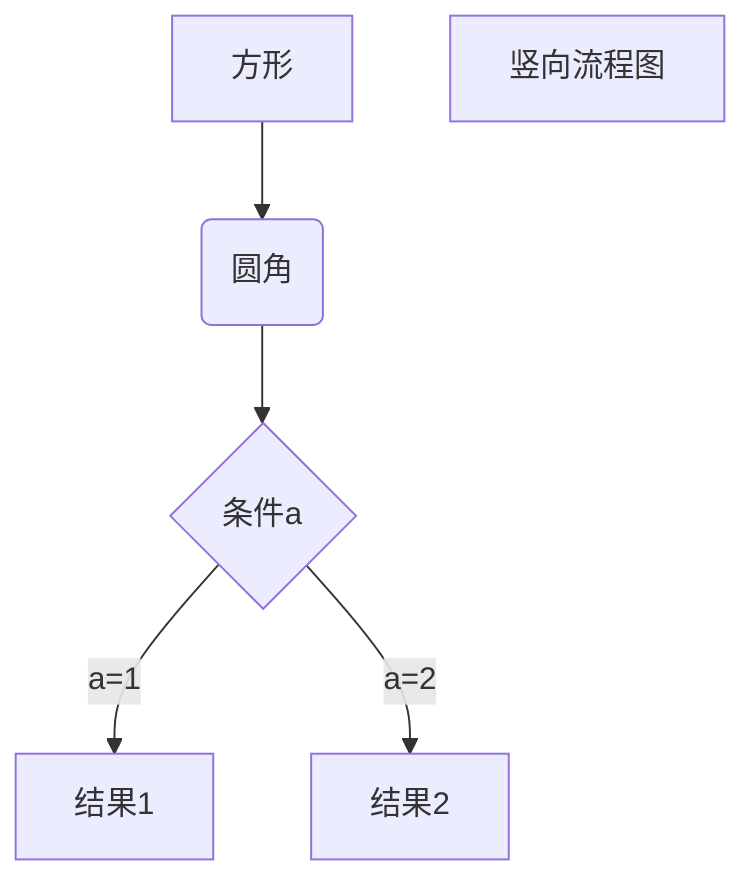

---
  
 
  

---

## 练习测试{#custom-id}


> 块注释，可以多次叠加


***斜体***


简单注脚[^1] ,提示词[^2]

[^2]:提前备注


[jump](#jump1)

__还是斜体__

<span id='jump1'>锚</span>

__加粗__

* 无序表 
   * 无序表子表[custom](#custom-1)
     * 子表子表

1. 原来如此
   2. 这是第二个	

[baidu link](http://baidu.com/)

[不知道行不行](http://www.bilibili.com/video/BV1JW411i731?p=4/)

我通过[公开课视频][1]复习了数据结构

[1]:https://www.bilibili.com/video/BV1JW411i731?p=4/


```python
def searchnumber( ):
    for i in range(len(number_set))
		if(number_set=abc):
            j++
```

~~[^又是啥]:小心火烛~~

[jump](#jump1)

### My Great Heading {#custom-3}

[测试标题](#japan-1)

[^1]:这是一个简单注脚

### My Great Heading {#custom-1}

<blockquote class="twitter-tweet"><p lang="ja" dir="ltr">Qiita Advent Calendar 2020 開催のお知らせ🎅<br><br>おかげさまで今年で開催10周年となりました！<br>今年は例年以上に楽しんでいただけるようにお楽しみ企画を多数ご用意しています🎄<br>詳細はBlogよりご覧ください。<br><br>みなさんのご参加お待ちしています🚀<a href="https://t.co/zR5SdARdbB">https://t.co/zR5SdARdbB</a></p>&mdash; Qiita (キータ) 公式 (@Qiita) <a href="https://twitter.com/Qiita/status/1323176042425540614?ref_src=twsrc%5Etfw">November 2, 2020</a></blockquote> <script async src="https://platform.twitter.com/widgets.js" charset="utf-8"></script>

​	

+ nihao

  `nano`

<code>nano</code>

[Heading IDs](#custom-3)   





 `rgba (0,255,0,0.4)`

<font face="宋体">我是黑体字</font>

<font color=#0099ff size=7 face="黑体">color=#0099ff size=72 face="黑体"</font>

<span style="display:block;text-align:right;color:orangered;">橙色居右</span>
<form oninput="x.value=parseInt(a.value)+parseInt(b.value)">0
<input type="range" id="a" value="50">100
+<input type="number" id="b" value="50">
=<output name="x" for="a b"></output>
</form>
